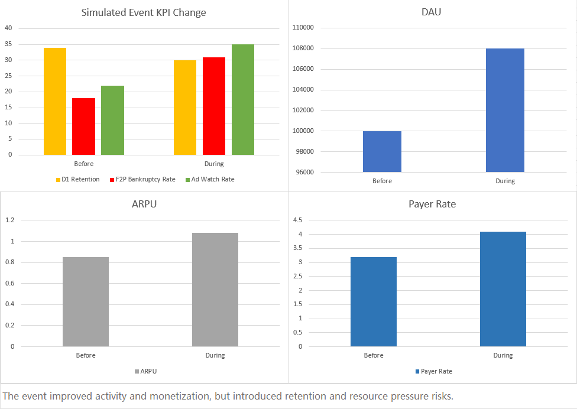
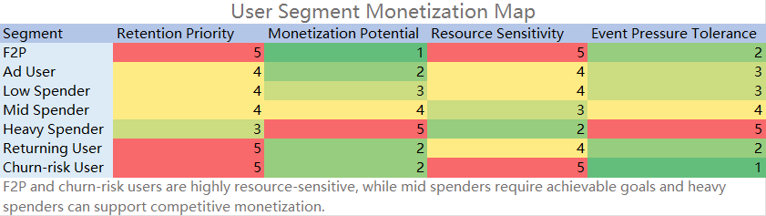
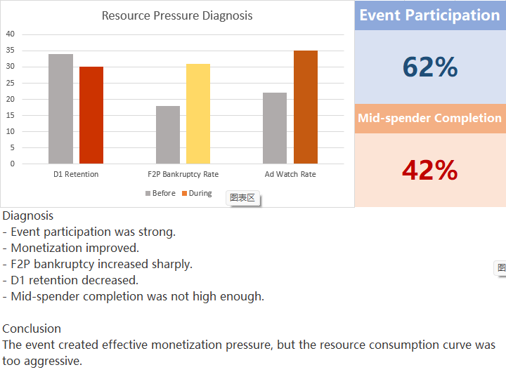
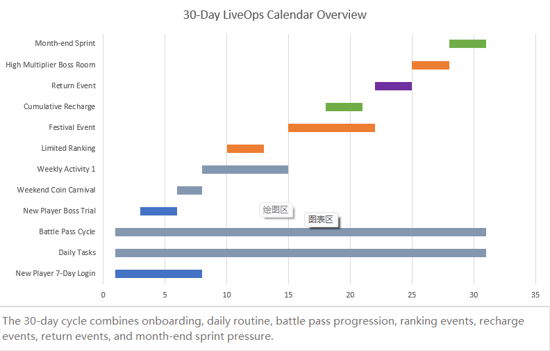

# Casual / Fishing Game Monetization System Teardown

## Project Overview

This is a portfolio analysis project focused on the monetization, resource economy, live-ops structure, and user segmentation of a typical casual / fishing-style mobile game.

The project does not analyze one specific product. Instead, it builds a representative model based on publicly observable gameplay patterns, common casual game monetization systems, and simulated example data.

No internal company data is used in this project. All metrics, user segments, and case data are simulated for analytical demonstration.

## Visual Highlights

### 1. Simulated Event KPI Change

This chart compares key metrics before and during the simulated limited-time event. The event improved DAU, payer conversion, and ARPU, but also reduced D1 retention and increased F2P bankruptcy rate.

### 2. User Segment Monetization Map

This map summarizes how different player segments respond to monetization pressure, rewarded ads, resource shortage, and live-ops events.

### 3. Resource Pressure Diagnosis

This chart highlights the core design risk of the simulated event: monetization pressure increased, but free-player resource exhaustion and mid-spender completion difficulty also increased.

### 4. 30-Day LiveOps Calendar Overview

This timeline shows how onboarding, daily tasks, battle pass, ranking events, recharge events, return events, and month-end sprint activities can be arranged across a 30-day cycle.

## Target Role Relevance

This project is relevant to:

- Game Operations
- System Design
- Numerical Design
- Monetization Design
- Casual Game Design
- User Growth
- User Acquisition
- Platform Operation

## Core Questions

This project analyzes the following questions:

1. How does a casual / fishing-style game build its core gameplay and resource loop?
2. How do soft currency, hard currency, stamina, tickets, items, event tokens, VIP, and battle pass experience interact?
3. How do paid bundles, rewarded ads, first purchase offers, bankruptcy offers, event bundles, and recharge rebates target different player states?
4. How can users be segmented by activity, payment behavior, ad behavior, and churn risk?
5. How should a 30-day live-ops cycle balance retention, activity participation, resource consumption, and monetization?
6. Which metrics should be monitored when evaluating retention, payment, event performance, and resource pressure?
7. How can a limited-time event increase DAU and payer conversion while reducing next-day retention?

## Methodology

~~~mermaid
flowchart LR
	A["Publicly observable gameplay"] --> B["System breakdown"]
	B --> C["Reasonable assumptions"]
	C --> D["Simulated data"]
	D --> E["KPI analysis"]
	E --> F["Risk diagnosis"]
	F --> G["Tuning recommendations"]
~~~

## Repository Contents

| Path | Description |
|---|---|
| `docs/01_research_framework.md` | Research scope, target roles, and methodology |
| `docs/02_core_loop.md` | Core loop breakdown and player/system motivation |
| `docs/03_currency_resource_system.md` | Currency, resource, item, ad, and paid resource structure |
| `docs/04_monetization_bundles.md` | Paid bundle and monetization point teardown |
| `docs/05_user_segmentation.md` | User segmentation model and operation strategies |
| `docs/06_liveops_calendar.md` | 30-day live-ops calendar example |
| `docs/07_metrics_framework.md` | KPI framework for retention, monetization, ads, events, and UA |
| `docs/08_simulated_case_study.md` | Simulated limited-time event analysis |
| `docs/09_project_summary.md` | Project conclusions and analytical value |
| `case_study/limited_time_event_analysis.md` | Detailed event diagnosis and tuning plan |
| `diagrams/` | Mermaid diagram source files |
| `tables/` | Structured analysis tables and simulated data |
| `images/` | Final visual outputs for README presentation |

## Data Disclaimer

This project does not use real backend data.

All numbers, conversion rates, retention changes, user segments, activity performance, and monetization results are simulated examples. They are used only to demonstrate analytical structure, system design reasoning, and KPI interpretation.

## Key Deliverables

- Core loop model for casual / fishing-style monetization games
- Currency and resource system table
- Paid bundle and monetization trigger analysis
- User segmentation model
- 30-day live-ops calendar
- KPI framework
- Simulated limited-time event case study
- Resource pressure and retention risk diagnosis
- Tuning recommendations for event design, reward tiers, ad supply, and leaderboard structure